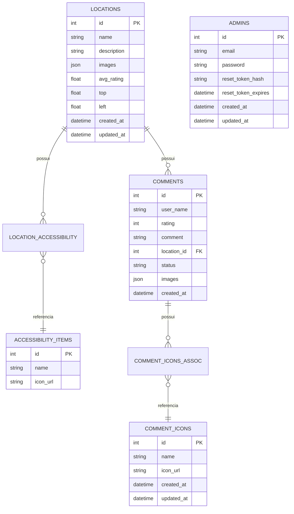

# Acesso Livre API

API backend para o projeto Acesso Livre, um projeto universitário desenvolvido para mapear o campus e identificar itens de acessibilidade em um mapa. Desenvolvida com FastAPI e hospedada no Render + Supabase.

## 🛠️ Tecnologias Utilizadas


## ⚠️ Nota sobre Performance

A API está hospedada no plano **Gratuito (Free Tier)** do Render. Isso significa que:

1. **Cold Start**: O serviço entra em hibernação após 15 minutos de inatividade. A primeira requisição após esse período pode levar **50 segundos ou mais** para ser processada enquanto o servidor "acorda".
2. **Swagger UI**: A interface de documentação (`/docs`) carrega esquemas pesados, o que pode parecer lento no primeiro acesso.

## Pré-requisitos

- Python 3.11+
- [Poetry](https://python-poetry.org/)

## Configuração

```bash
# Clone o repositório
git clone https://github.com/Acesso-Livre/acesso-livre-api.git
cd acesso-livre-api

# Configure variáveis de ambiente
cp .env.example .env

# Instale dependências
poetry install

# Crie as tabelas no banco de dados
poetry run alembic upgrade head

# Execute a aplicação
poetry run uvicorn acesso_livre_api.src.main:app --reload
```

## 🔑 Variáveis de Ambiente

Renomeie o arquivo `.env.example` para `.env` e configure as seguintes variáveis:

| Variável                      | Descrição                                                   |
| ----------------------------- | ----------------------------------------------------------- |
| `DATABASE_URL`                | String de conexão com o banco de dados PostgreSQL           |
| `API`                         | Nome da API (ex: `Acesso Livre API`)                        |
| `FRONTURL`                    | URL do Frontend (usada para gerar links enviados por email) |
| `SECRET_KEY`                  | Chave secreta para assinatura de tokens JWT                 |
| `ALGORITHM`                   | Algoritmo de criptografia (padrão: `HS256`)                 |
| `ACCESS_TOKEN_EXPIRE_MINUTES` | Tempo de expiração do token de acesso                       |
| `MODE`                        | Ambiente de execução (`development` ou `prod`)              |
| `BUCKET_NAME`                 | Nome do bucket no Supabase Storage                          |
| `BUCKET_ENDPOINT_URL`         | URL do endpoint do Supabase                                 |
| `BUCKET_SECRET_KEY`           | Chave de serviço (Service Role) do Supabase                 |
| `EMAILJS_*`                   | Configurações para envio de emails via EmailJS              |

## 👤 Criação de Administrador

Para criar o primeiro administrador (que terá acesso para criar outros via API), utilize o script dedicado na raiz do projeto:

```bash
# Sintaxe: poetry run python create_admin.py <email> <senha>
poetry run python create_admin.py admin@example.com senha123
```

> **Nota:** Este script conecta diretamente ao banco de dados, ignorando a autenticação da API. Use-o apenas para criar o usuário inicial ou em casos de recuperação de acesso.

## 🔄 Migrations (Banco de Dados)

O projeto utiliza **Alembic** para gerenciamento de versões do banco de dados.

```bash
# Aplicar todas as migrations (atualizar banco)
poetry run alembic upgrade head

# Criar uma nova migration (após alterar models)
poetry run alembic revision --autogenerate -m "descrição da mudança"
```

## Documentação da API

A documentação interativa está disponível em: `http://localhost:8000/docs`

## 🗄️ Modelo de Dados



---

## 🧪 Testes Automatizados

O projeto mantém uma suíte robusta de testes automatizados utilizando **Pytest**, garantindo a qualidade e estabilidade do código.

### Executando os Testes

```bash
# Executar todos os testes
poetry run pytest

# Executar com cobertura de código
poetry run pytest --cov=acesso_livre_api

# Executar apenas testes de integração
poetry run pytest -m integration
```

### Estrutura de Testes

- **Testes Unitários**: Isolam componentes individuais (services, models) para verificar sua lógica interna sem dependências externas.
- **Testes de Integração**: Verificam o funcionamento conjunto de vários módulos, incluindo a interação com o banco de dados (usando um banco de teste SQLite em memória ou arquivo).

---

## 🚀 Testes de Carga

Testes de performance usando [k6](https://k6.io/).

### O que é VU?

**VU = Virtual User** (Usuário Virtual) - simula uma pessoa real acessando a API.

### Como Executar

**Load Test** - 200 usuários simultâneos por 2 minutos:

```bash
k6 run --vus 200 --duration 2m k6/load-test.js
```

**Stress Test** - Até 400 usuários para encontrar o limite:

```bash
k6 run k6/stress-test.js
```

### Rotas Testadas

| Método | Endpoint                               |
| ------ | -------------------------------------- |
| GET    | `/api/locations/`                      |
| GET    | `/api/locations/accessibility-items/`  |
| GET    | `/api/locations/{id}`                  |
| GET    | `/api/comments/recent`                 |
| GET    | `/api/comments/icons/`                 |
| GET    | `/api/comments/{location_id}/comments` |

### Resultados (13/12/2025)

#### Load Test - 200 VUs

| Métrica       | Valor     |
| ------------- | --------- |
| Requisições   | 4.484     |
| Duração Média | 5,412 ms  |
| P95           | 18,498 ms |
| Taxa de Erro  | 0,71%     |

#### Stress Test - 400 VUs

| Métrica       | Valor    |
| ------------- | -------- |
| Requisições   | 9.778    |
| Duração Média | 3650 ms  |
| P95           | 11390 ms |
| P99           | 11890 ms |
| Taxa de Erro  | 0,00% ✅  |

### O que significam as métricas?

- **Duração Média**: Tempo médio de resposta por requisição
- **P95/P99**: X% das requisições foram mais rápidas que esse tempo
- **Taxa de Erro**: Porcentagem de requisições que falharam
