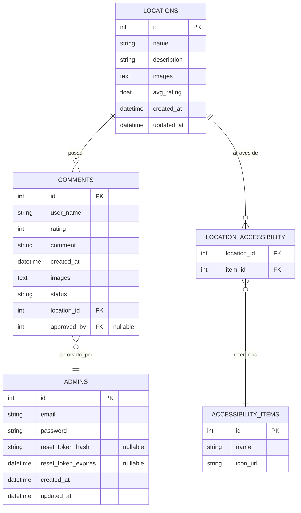

# Acesso Livre API

## Visão Geral

Acesso Livre API é um projeto baseado em FastAPI, projetado para fornecer uma solução de backend robusta e escalável. Este projeto utiliza Python 3.12 e bibliotecas modernas como FastAPI e Pydantic para um desenvolvimento eficiente.

## Pré-requisitos

Antes de começar, certifique-se de ter os seguintes itens instalados:

- Python 3.12
- [Poetry](https://python-poetry.org/) para gerenciamento de dependências

## Instruções de Configuração

### 1. Clone o Repositório

```bash
git clone <repository-url>
cd acesso-livre-api
```

### 2. Crie e Configure Variáveis de Ambiente

Copie o arquivo `.env.example` para `.env` e ajuste os valores conforme necessário:

```bash
cp .env.example .env
```

### 3. Instale as Dependências

Use o Poetry para instalar as dependências do projeto:

```bash
poetry install
```

### 4. Execute a Aplicação

Inicie a aplicação FastAPI:

```bash
poetry run uvicorn acesso_livre_api.src.main:app --reload
```

## 🗄️ Modelo de Dados


